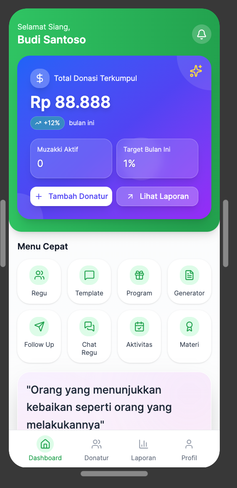
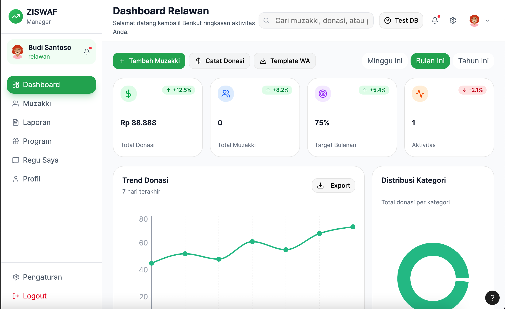

# Volunteer Dashboard Design

This is a code bundle for Volunteer Dashboard Design. The original project is available at https://www.figma.com/design/TeOSmOcWhrlNFUXwRsequL/Volunteer-Dashboard-Design.

## Screenshots

### Mobile Dashboard

### Desktop Dashboard  

## 🚀 Running the code

Run `npm i` to install the dependencies.

Run `npm run dev` to start the development server.

## 🛠️ Tech Stack

- **Frontend**: React + TypeScript + Vite
- **UI Components**: TailwindCSS + shadcn/ui
- **Backend**: Convex (Real-time Database) + Supabase (Alternative)
- **Storage**: Convex Storage + Backblaze B2
- **Authentication**: Phone-based OTP system

## 📋 Features

- ✅ **User Management**: Phone-based authentication with OTP
- ✅ **Donation Management**: Track and validate donations
- ✅ **Team Management**: Organize volunteers into teams (Regu)
- ✅ **Donor Management**: Manage muzakki/donor database
- ✅ **Real-time Updates**: Live data synchronization
- ✅ **Mobile Responsive**: Works on all device sizes
- ✅ **Admin Dashboard**: Complete admin interface

## 🔧 Environment Setup

1. Copy `.env.example` to `.env.local`
2. Configure your Convex and Supabase credentials
3. Run `npm run dev` to start development

## 📝 Recent Updates

- ✅ Fixed invalid date display in donation validation page
- ✅ Implemented consistent snake_case field naming across backend
- ✅ Added proper error handling for date formatting
- ✅ Enhanced mobile responsiveness